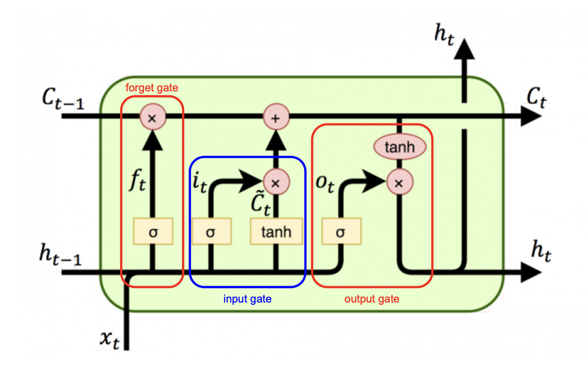

# Long short-term memory
Sepp Hochreiter & Jürgen Schmidhuber

## Summary
RNN(Recurrent Neural Network)에서 time-step이 커진수록 backprop되면서 1보다 작거나 큰 값이 반복적으로 곱해지며 gradient가 vanishing, exploding되는 문제가 있었다. input gate, output gate, forget gate를 가지는 memory cell을 사용해 이를 해결하고 단기적, 장기적인 정보를 유지할 수 있는 방안을 제시한다.

## Related Work
### FFNN

$$h_{next}=relu(x \cdot W_x+b)$$

### RNN

$$h_{next}=tanh(h_{prev} \cdot W_h+x \cdot W_x+b)$$

## Method

### Forget Gate
이전 cell state 정보를 잊을지 말지 결정
- 0이면 이전 cell state 정보는 0
- 1이면 이전 cell state 정보는 그대로 유지

$$f_t=\sigma(W_f \cdot x_t + U_f \cdot h_{t-1}+b_f)$$

### Input Gate
현재 입력 정보를 얼마나 반영할지 결정

$$i_t=\sigma(W_i \cdot x_t+U_i \cdot h_{t-1}+b_i)$$
$$\tilde{c_t}=tanh(W_c \cdot x_t + U_c \cdot h_{t-1}+b_c)$$

### Update
forget, input gate에서 결정한 대로 새로운 state 생성

$$c_t=f_t \odot c_{t-1}+i_t \odot \tilde{c_t}$$

### Output Gate
업데이트된 cell state를 기반으로 LSTM 셀의 출력을 결정

$$o_t=\sigma(W_o \cdot x_t+U_o \cdot h_{t-1}+b_o)$$
$$h_{t}=o_t \odot tanh(c_t)$$
